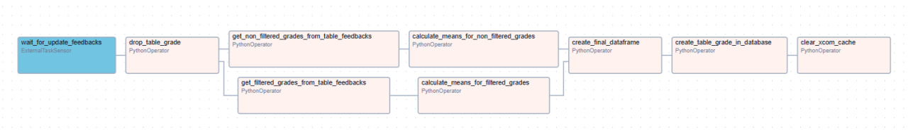
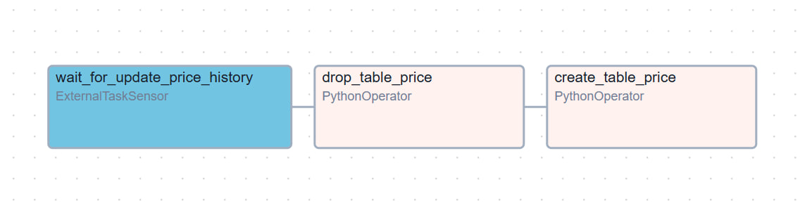

# Create DAGs

Folder contains DAGs that create new tables in database.

## DAGs

 * [**grade**](grade) - DAG that create table **grade** in database. 

 * [**price**](price) - DAG that create table **price** in database.

## Diagrams of DAG

### Create table grade

### Create table price

