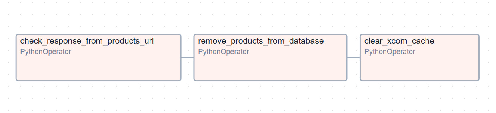

# Remove DAGs

Folder contains DAGs that remove data from database.

## DAGs

 * [**products**](products) - DAG that remove data of products that no long exist in web-store. 

## Diagrams of DAG

### Remove products

