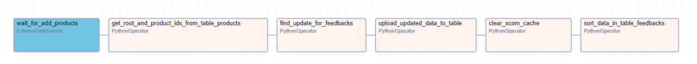
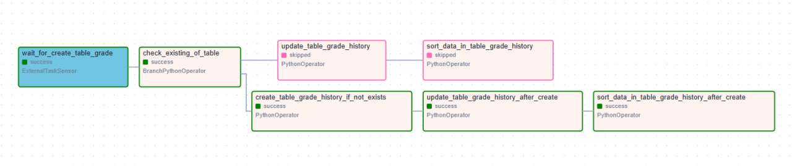
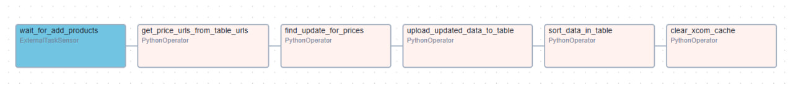
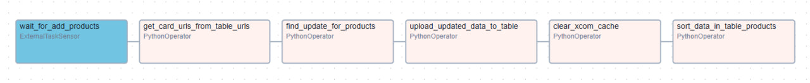

# Update DAGs

Folder contains DAGs that update existed information of products in database, like:
 * Update price of existing products in table **price_history**;
 * Update feedbacks of existing products in table **feedbacks**;
 * Update by adding data from table **grade** in table **grade_history**;
 * Update personal info of existing products in table **products**;

## DAGs

 * [**feedbacks**](feedbacks) - DAG that update table **feedbacks** by adding new feedback; 
 * [**grade_history**](grade_history) - DAG that update table **grade_history** by adding data from table **grade**; 
 * [**price_history**](price_history) - DAG that update table **price_history** by adding new price from web-store;
 * [**products**](products) - DAG that update personal info of existing products in table **products**;

## Diagrams of DAG

### Update feedbacks

### Update grade history

### Update price history

### Update products
